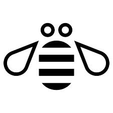

## About
I'm a natural builder and creative problem solver that has developed a passion for working with data. I have been coding and team building since middle school to help solve technical problems. I've had the pleasure of learning from very talented people in IT administration, AR/VR software development, secure data engineering and analysis, information architecture and ML algorithm development. The faculty at the University of Colorado, Boulder, fostered my love for studying data that represents human behavior and applying principles of psychology to explain that behavior. Since graduation I have been seeking work with health-tech products that center the patient experience. I am also earning an EMT-Basic certification.
---

## I'm still putting some projects together

  

    <h1>Data Analysis</h1>
    

        <a href="https://basalt-streetcar-3c0.notion.site/One-page-writeup-aa8b0d8e9bf3494b9117db7b62113f8e" target="_blank">
            
            

            <h3 style="margin:0;">Hack for Racial Justice</h3>
            

        </a>
    

    

        <a href="https://basalt-streetcar-3c0.notion.site/Solve-Analytics-3f5366399adb4166a15c4d483f7a1a31" target="_blank">
            
            

            <h3 style="margin:0;">IBM Special Project (SOLVE)</h3>
            

        </a>
    

  

  

    <h1>NLP and AI</h1>
    

        <a href="https://basalt-streetcar-3c0.notion.site/Company-name-generator-e1bcef8f7aa648eeb667b0b7048e412d" target="_blank">
            
            

            <h3 style="margin:0;">Convolutional RNN Text generation</h3>
            

        </a>
    

  

---
[Project 3 Title]()

---

### Category Name 2

- [Project 1 Title](http://example.com/)
- [Project 2 Title](http://example.com/)
- [Project 3 Title](http://example.com/)
- [Project 4 Title](http://example.com/)
- [Project 5 Title](http://example.com/)

---

---

Page template forked from <a href="https://github.com/evanca/quick-portfolio">evanca</a>

<!-- Remove above link if you don't want to attibute -->
